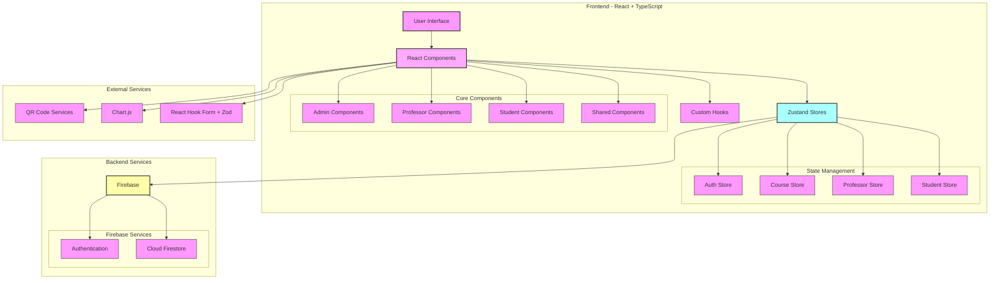

# QR Attendance System - Architecture Documentation

## System Architecture Diagram



## Architecture Overview

### Frontend Layer

#### User Interface (React + TypeScript)
- Built with React and TypeScript for type safety
- Utilizes Tailwind CSS for styling
- Responsive design for multiple device types

#### Component Structure
1. **Admin Components**
   - Professor management
   - Course management
   - Student management
   - System analytics

2. **Professor Components**
   - QR code generation
   - Attendance tracking
   - Student management
   - Course analytics

3. **Student Components**
   - QR code scanning
   - Attendance history
   - Course enrollment view
   - Personal statistics

4. **Shared Components**
   - Navigation
   - Layout
   - Common UI elements
   - Utility components

#### State Management
- **Zustand Stores**
  - AuthStore: User authentication state
  - CourseStore: Course management
  - ProfessorStore: Professor data
  - StudentStore: Student information

#### Custom Hooks
- Attendance tracking
- QR code handling
- Analytics processing
- Form management

### Backend Services

#### Firebase
1. **Authentication**
   - User management
   - Role-based access control
   - Session management

2. **Cloud Firestore**
   - Real-time data synchronization
   - Document-based data storage
   - Complex queries support

### External Services Integration

#### QR Code Services
- QR code generation (react-qr-code)
- QR code scanning (qr-scanner)
- Real-time attendance marking

#### Analytics
- Chart.js integration
- Real-time data visualization
- Statistical analysis

#### Form Handling
- React Hook Form for form management
- Zod for schema validation
- Type-safe form submissions

## Data Flow

1. **Authentication Flow**
   ```
   User Login → Auth Store → Firebase Auth → Access Grant/Deny
   ```

2. **Attendance Marking Flow**
   ```
   Professor Generate QR → Student Scan → Firestore Update → Real-time UI Update
   ```

3. **Analytics Flow**
   ```
   Firestore Data → Custom Hooks → Chart.js → UI Display
   ```

## Security Considerations

1. **Authentication**
   - Role-based access control
   - Secure session management
   - Protected routes

2. **Data Access**
   - Firestore security rules
   - Data validation
   - Input sanitization

3. **QR Code Security**
   - Time-limited QR codes
   - Unique session IDs
   - Validation checks

## Performance Optimizations

1. **Code Splitting**
   - Route-based code splitting
   - Lazy loading of components
   - Dynamic imports

2. **State Management**
   - Efficient store updates
   - Minimized re-renders
   - Optimized queries

3. **Data Fetching**
   - Real-time updates when needed
   - Cached data when appropriate
   - Optimized Firestore queries

## Deployment Architecture

1. **Frontend Deployment**
   - Static file hosting
   - CDN distribution
   - Build optimization

2. **Backend Services**
   - Firebase hosting
   - Automatic scaling
   - Global distribution

## Future Considerations

1. **Scalability**
   - Horizontal scaling capability
   - Performance monitoring
   - Load balancing

2. **Maintainability**
   - Modular architecture
   - Clear documentation
   - Testing strategy

3. **Extensibility**
   - Plugin architecture
   - API versioning
   - Feature flagging
