# QR Attendance System

A modern web application for managing student attendance using QR codes. Built with React, TypeScript, and Firebase.

## Use Case Diagram

```mermaid
graph TB
    subgraph "QR Attendance System"
        Admin["👤 Admin"]
        Professor["👨‍🏫 Professor"]
        Student["👨‍🎓 Student"]

        subgraph "Admin Use Cases"
            ManageProfs["Manage Professors"]
            ManageCourses["Manage Courses"]
            ManageStudents["Manage Students"]
            ViewStats["View System Statistics"]
            AssignCourses["Assign Courses"]
            EditAttendance["Edit Attendance Records"]
        end

        subgraph "Professor Use Cases"
            GenQR["Generate QR Code"]
            ViewStudents["View Enrolled Students"]
            TrackAttendance["Track Attendance"]
            ViewAnalytics["View Analytics"]
            ManageStatus["Manage Attendance Status"]
        end

        subgraph "Student Use Cases"
            ScanQR["Scan QR Code"]
            ViewCourses["View Enrolled Courses"]
            CheckHistory["Check Attendance History"]
            ViewStats2["View Personal Statistics"]
        end

        %% Admin connections
        Admin --> ManageProfs
        Admin --> ManageCourses
        Admin --> ManageStudents
        Admin --> ViewStats
        Admin --> AssignCourses
        Admin --> EditAttendance

        %% Professor connections
        Professor --> GenQR
        Professor --> ViewStudents
        Professor --> TrackAttendance
        Professor --> ViewAnalytics
        Professor --> ManageStatus

        %% Student connections
        Student --> ScanQR
        Student --> ViewCourses
        Student --> CheckHistory
        Student --> ViewStats2
    end

    style Admin fill:#f9f,stroke:#333,stroke-width:2px
    style Professor fill:#bbf,stroke:#333,stroke-width:2px
    style Student fill:#bfb,stroke:#333,stroke-width:2px
```



## Features

### For Administrators
- Manage professors, courses, and students
- View and edit attendance records
- Bulk import students via Excel
- Assign/unassign courses to professors and students
- Monitor attendance statistics and analytics

### For Professors
- Generate QR codes for attendance tracking
- View enrolled students for each course
- Track attendance records and statistics
- Manage attendance statuses (Present, Absent, Late, Excused)
- View detailed attendance analytics

### For Students
- Scan QR codes to mark attendance
- View enrolled courses
- Track personal attendance history
- See attendance statistics per course

## Technology Stack

- **Frontend Framework**: React with TypeScript
- **Styling**: Tailwind CSS
- **State Management**: Zustand
- **Authentication & Database**: Firebase
- **QR Code**: react-qr-code (generation) & qr-scanner (scanning)
- **Charts**: Chart.js with react-chartjs-2
- **Forms**: React Hook Form with Zod validation
- **Date Handling**: date-fns
- **Icons**: Lucide React

## Project Structure

```
src/
├── components/
│   ├── admin/         # Admin-specific components
│   ├── professor/     # Professor-specific components
│   ├── student/       # Student-specific components
│   ├── layout/        # Layout components
│   └── shared/        # Shared/common components
├── hooks/             # Custom React hooks
├── lib/              # External library configurations
├── pages/            # Page components
├── store/            # Zustand store definitions
├── types/            # TypeScript type definitions
└── utils/            # Utility functions
```

## Key Features Implementation

### QR Code Generation
- Professors can generate unique QR codes for each class session
- QR codes include course ID, session ID, and timestamp
- Configurable time limit for attendance marking

### Attendance Tracking
- Real-time attendance marking
- Multiple attendance statuses (Present, Absent, Late, Excused)
- Historical attendance records
- Detailed analytics and statistics

### User Management
- Role-based access control (Admin, Professor, Student)
- Course assignment system
- Student enrollment management
- Professor course assignment

### Analytics
- Attendance percentage calculations
- Course-wise attendance tracking
- Student performance monitoring
- Visual representations using charts

## Deployment

The application can be deployed to various platforms:

### Netlify
1. Connect your repository to Netlify
2. Configure build settings:
   - Build command: `npm run build`
   - Publish directory: `dist`
3. Add environment variables in Netlify dashboard

### Render
1. Create a new Web Service
2. Connect your repository
3. Configure build settings:
   - Build command: `npm run build`
   - Static site output directory: `dist`
4. Add environment variables

<br>

[Live link](https://attendance-canva.netlify.app/login)
